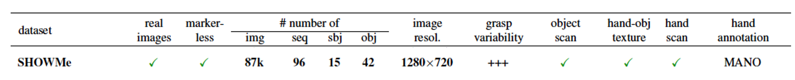

SHOWMe dataset, Copyright (c) 2023 Naver Corporation / Inria centre at the University Grenoble Alpes

# SHOWMe dataset
A high-quality hand-object dataset with accurate ground truth meshes with textures. We collect 96 sequences from 15 different subjects holding 42 different objects from everyday life, with various sizes and shapes. The subjects reflect diversity in gender, color, and hand shape. The different grasp types(power-grasp, use-grasp, handover-grasp) are evenly represented. Each video sequence lasts an average of 48 seconds. This represents a total of 87,540 frames.

## Dataset Contents
- [x] 96 sequences
- [x] RGB images
- [x] Depth data
- [x] GT Hand-object Meshes
- [x] GT Object Meshes
- [x] Hand-Object 6DoF pose annotations
- [x] MANO Parameteric annotations

## Dataset Info




## Dataset Directory structure
<details>
<summary>Click to show "SHOWMe" directory structure</summary>
<div style="overflow-y: scroll; height: 400px;">
  <pre>
>> SHOWMe.zip --> unzip SHOWMe.zip 
    SHOWMe
    |-- 20220705173214
    |   |-- gt_mesh
            |-- ho
            |   |-- homesh.obj
            |   |-- material0.jpeg
            |   |-- material0.mtl
            |-- mano_mesh
            |   |-- mano.obj
            |-- obj_mesh
            |   |-- material_0.jpeg
            |   |-- material_0.mtl
            |   |-- objmesh.obj
    |   |-- icp_res
            |-- 0000000000
            |   |-- f_trans.txt
            |-- 0000000001
            |   |-- f_trans.txt
                ...
                ...
    |   |-- registration.json
    |   |-- rgb
            |-- 0000000000.png
            |-- 0000000001.png
                    ...
                    ...
    |-- 20220805164755
    |   |-- gt_mesh
            |-- ho
            |   |-- homesh.obj
            |   |-- material0.jpeg
            |   |-- material0.mtl
            |-- mano_mesh
            |   |-- mano.obj
            |-- obj_mesh
            |   |-- material_0.jpeg
            |   |-- material_0.mtl
            |   |-- objmesh.obj
    |   |-- icp_res
            |-- 0000000000
            |   |-- f_trans.txt
            |-- 0000000001
            |   |-- f_trans.txt
                ...
                ...
    |   |-- registration.json
    |   |-- rgb
            |-- 0000000000.png
            |-- 0000000001.png
                    ...
                    ...
            ...
            ...
    |-- 20220809171854
    |   |-- gt_mesh
            |-- ho
            |   |-- homesh.obj
            |   |-- material0.jpeg
            |   |-- material0.mtl
            |-- mano_mesh
            |   |-- mano.obj
            |-- obj_mesh
            |   |-- material_0.jpeg
            |   |-- material_0.mtl
            |   |-- objmesh.obj
    |   |-- icp_res
            |-- 0000000000
            |   |-- f_trans.txt
            |-- 0000000001
            |   |-- f_trans.txt
                ...
                ...
    |   |-- registration.json
    |   |-- rgb
            |-- 0000000000.png
            |-- 0000000001.png
                    ...
                    ...
  </pre>
</div>
</details>

<details>
<summary>Click to show "SHOWMe_depth" directory structure</summary>
<div style="overflow-y: scroll; height: 400px;">
  <pre>
>> SHOWMe_depth.zip --> unzip SHOWMe_depth.zip
SHOWMe_depth
  |-- 20220805164755
  |   |-- depth
          |-- 0000000000.xyz.npz
          |-- 0000000001.xyz.npz
              ...
              ...
  |-- 20220805165947
  |   |-- depth
          |-- 0000000000.xyz.npz
          |-- 0000000001.xyz.npz
              ...
              ...
        ...
        ...
  |-- 20220913154643
  |   |-- depth
          |-- 0000000000.xyz.npz
          |-- 0000000001.xyz.npz
                ...
                ...
  </pre>
</div>
</details>


## License
The SHOWMe dataset is licensed under the Creative Commons Attribution-NonCommercial-ShareAlike 4.0 license.

A summary of the CC BY-NC-SA 4.0 license is located here:
    https://creativecommons.org/licenses/by-nc-sa/4.0/

The CC BY-NC-SA 4.0 license is located here:
    https://creativecommons.org/licenses/by-nc-sa/4.0/legalcode


## Citation

If you use our dataset, please cite our ICCVW'23 paper:
```bibtex
@inproceedings{showme,
  title={{SHOWMe: Benchmarking Object-agnostic Hand-Object 3D Reconstruction}},
  author={{Swamy, Anilkumar and Leroy, Vincent and Weinzaepfel, Philippe and Baradel, Fabien and Galaaoui, Salma and Brégier, Romain and Armando, Matthieu and Franco, Jean-Sebastien and Rogez, Grégory}},
  booktitle={{ICCVW}},
  year={2023}
}
```

